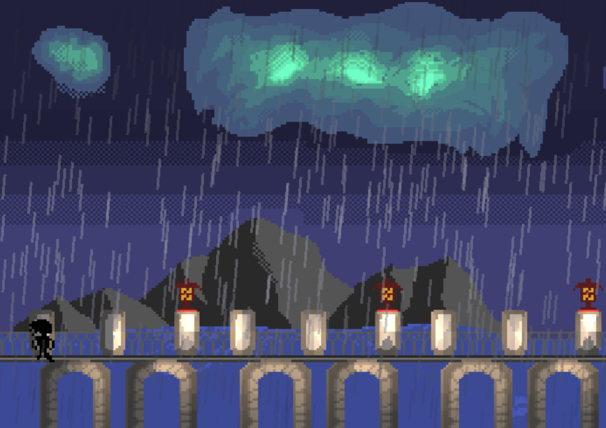

### A Walk in the Night: A 2-Dimensional Walking Sim

A Walk in the Night is a handmade 2D walking simulator for Windows written in C++ and OpenGL. This game (in which admittedly more attention was given to code than art) displays a moody, rain-soaked environment that you slowly walk through with a little animated character.

This engine is built on direct C++ [.NET](https://learn.microsoft.com/en-us/docs/) and [MS OpenGL](https://learn.microsoft.com/en-us/windows/win32/opengl/opengl) API calls, and uses functions from [stb_vorbis](https://github.com/nothings/stb) to speed up image and audio processing. Using these as building blocks, this engine assembles: 
- An OpenGL-based renderer that combines a pixilated internal resolution with finer-grained effects via game objects and shaders
- An internal (320 x 180 resolution) game engine with support for character animations, keyboard input, and moving scenes
- A rain system that tracks individual properties for each raindrop (1,000 by default) and uses instancing to render the set in a single draw call
- A lighting system that takes a specified normal map as an input and weighs its angles against a given set of light sources

To give some intuition for this last bullet point: this game's lighting system computes the color of each pixel based on a combination of ambient and diffuse lighting. While ambient lighting can be handled by multiplying color by a uniform lighting constant, diffuse lighting depends on the relationship between the point itself and our defined light sources.

For this, we can specify a normal map across our internal resolution by creating an analogous PNG file that we load alongside the scene itself. For each pixel within our scene that can be lit, we specify an angle on the 360 degree scale and encode it into the R (0 - 255) and G (0 - 105) channels of the normal map:

TODO: include normal map screenshot

[SCREENSHOT OF scene pixels to normal map demo]

We can then have these surfaces' angle of interaction dictate the effects of our in-game light sources: for each pixel, we take the cosine between its normalized displacement vector from the light and the normal vector that we specified in our initial encoding. This tells us the degree to which the surfaces face each other: and we can then make computations with respect to other metadata (e.g. color, distance, intensity) to determine the influence of the light source on the pixel's final colors.

Because we specify these effects in our shaders, they have sub-pixel detail: while the normal map regions are specified to the pixel, the precision of the light affecting them is constrained by the PC resolution itself. The runtime per pixel is upper-bounded by our maximum number of light sources (8), and the only time our GPU code branches is in the case of an unspecified normal map (e.g. rendering the pixel color as-is). As this is the biggest computation cost, the game can comfortably operate at 60FPS.

**Project Todos:**
- Refactor player system
- Use WASAPI to finish loading in audio
